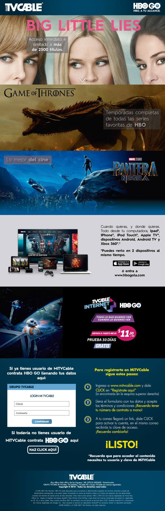

> **HBO was available through Xtrim — but clients didn't know it, or didn't feel compelled to add it. The goal was simple: design a landing page that made the service impossible to ignore and the subscription easy to start.**

### Project Overview

In 2018, Xtrim / Grupo TVCable needed a dedicated landing page to promote the HBO streaming service to their existing client base and attract new subscribers in Ecuador. The page was designed to communicate the value of the service clearly, create visual excitement around the content offering, and convert visitors into paying subscribers.

The design was handed off to the IT department for development, which adapted it to be responsive across devices.

---

### Role

UX/UI Designer · In-house · Xtrim / Grupo TVCable (2018)

---

### Design Approach

The landing page was built around a single conversion goal — get the visitor to subscribe. Every design decision supported that objective.

- High-quality licensed imagery provided directly by the HBO brand — ensuring visual authenticity and legal compliance
- Parallax scrolling effect to create a sense of depth and modernity, reinforcing the premium feel of the service
- Clear content hierarchy guiding the user from awareness to action
- Strong CTAs strategically placed throughout the page
- Close collaboration with the sales team to align messaging with active campaigns
- Responsive layout — adapted by the IT department for mobile and tablet

---

### Tools

- Adobe Illustrator — layout, graphics, and visual assets
- Adobe Photoshop — image editing and composition
- CMS — used by the IT department for development and content management

---

### Impact

The landing page directly contributed to a measurable increase in HBO subscriptions through the Xtrim platform — validating the design's effectiveness in converting visitors into subscribers and demonstrating the business value of a well-executed, conversion-focused UX/UI approach.
