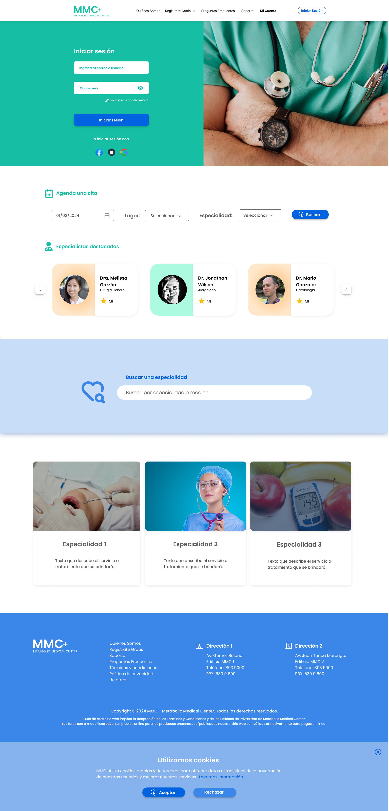

> **How do you make scheduling a medical appointment feel as simple as booking a restaurant? That was the design challenge behind MMC — a full-stack web app built from Figma prototype to deployed frontend, covering every screen and every interaction in between.**

### Project Overview

Metabolic Medical Center (MMC) is an academic full-stack web application designed to streamline appointment scheduling for a fictional medical center. Patients can create an account, access a personal dashboard to manage their appointments, browse available medical specialties, and update their personal information — all in one place.

The project was built end to end by a team of three — I led the UX/UI design and frontend development, while the backend was handled by a teammate.

---

### Role

UX/UI Designer · Frontend Developer · Academic Project · Team of 3 (2024)

---

### 🎨 Design System

  

  <iframe
      style="position: absolute; top: 0; left: 0; width: 100%; height: 100%; border: 1px solid rgba(0,0,0,0.1);"
      src="https://embed.figma.com/design/MfrnhTj5ALfBNcOIU0vQcG/MMC?node-id=0-1&embed-host=share"
      allowfullscreen
      loading="lazy"
    ></iframe>
  

A full design system was built in Figma before any code was written — establishing the visual foundation for every screen and component in the app.

- Logo design created for the MMC brand
- Typography and color schemes defined from scratch
- Custom icon set and avatar system
- Button styles with full state coverage — primary, secondary, disabled
- Color palette documented and applied consistently across all screens

**Color Schemes**

**Button Styles**

**Brand variations of colors and aplications**

**Brand Horizontal orientation**

**Icons & Avatars**

---

### 🚀 Project Features

- A platform functioning as an administrator for a medical center
- Allows patients to schedule appointments through the platform
- Provides access to the catalog of medical specialties directly on the platform
- Enables users to create an account and edit their contact information
- Responsive design built with Tailwind CSS for mobile and desktop

---

### 💡 Screen Design

Every screen was designed in Figma first, then implemented in React.

**Home**

---

**Register Form**

---

**User Dashboard**

---

### 💡 Interactive Prototype

An interactive prototype of the application can be accessed here:

<!-- Desktop: visible solo en pantallas >= 768px -->

  

    <iframe
      style="position: absolute; top: 0; left: 0; width: 100%; height: 100%; border: 1px solid rgba(0,0,0,0.1);"
      src="https://embed.figma.com/proto/MfrnhTj5ALfBNcOIU0vQcG/MMC?node-id=59-43&starting-point-node-id=59%3A43&embed-host=share"
      allowfullscreen
      loading="lazy"
    ></iframe>
  

<!-- Mobile -->

  
  <a href="https://www.figma.com/design/MfrnhTj5ALfBNcOIU0vQcG/MMC" target="_blank"
     style="display: inline-block; margin-top: 12px; color: #a855f7; text-decoration: underline;">
    Ver prototipo interactivo →
  </a>

---

### 🛠️ Technologies Used

**Frontend**

- Framework: React + Vite
- Language: JavaScript
- Styling: Bootstrap + Tailwind CSS
- Deployment: Netlify

**Backend**

- Runtime: Node.js
- Database: MySQL
- Deployment: Local

**Design**

- Figma — design system, wireframes, UI mockups, interactive prototype

---

### ✒️ Collaborators

- **Marco Ramírez** — Backend Development & Documentation
- **María Paula Cevallos** — UX/UI Design, Frontend Development & Documentation
- **Franziska Stude** — Documentation

---

### Value Delivered

A fully deployed frontend built on a complete design system — from logo to component library to interactive prototype. The app covers the full patient journey: registration, login, appointment scheduling, specialty browsing, and profile management. The frontend is live on Netlify and the architecture is ready to connect to a production backend when needed.

## 🚀 Deployment

[Preview →](https://mmc-tfm-frontend.netlify.app/)
