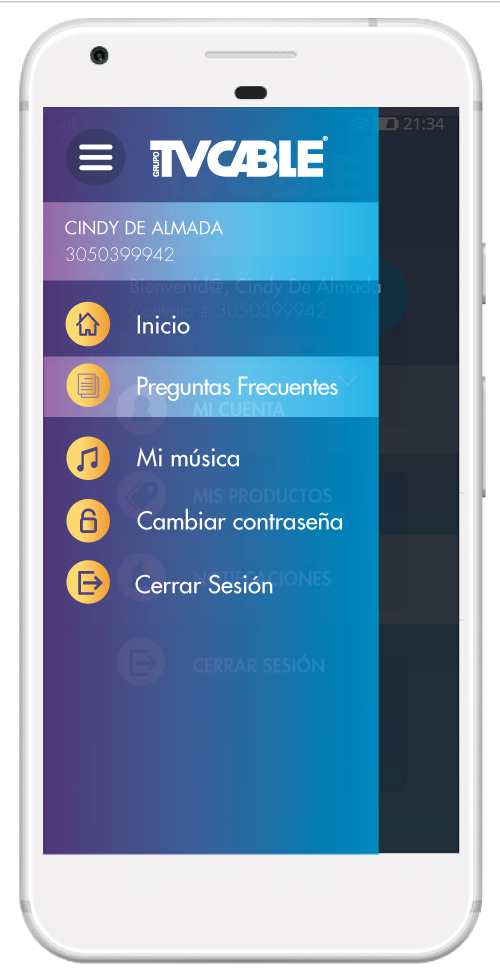

### Project overwiew:

I contributed to the UX/UI design of a mobile application that allows clients to easily check their account status, make payments, access special offers, and update personal information. I worked closely with the development team who implemented the app on both Android and iOS platforms.

### Responsibilities and Achievements:

- Created UX/UI designs using Adobe Illustrator and Photoshop.
- Collaborated with developers to ensure design fidelity during implementation.
- Improved user experience by simplifying payments and real-time account access.
- Helped increase customer satisfaction and operational efficiency.

### Role

- UI UX Designer

### Tools

- Adobe Illustrator
- Adobe Photoshop
- HTML5
- CSS3

---

- Developed a mobile application that facilitated easier payment processing for clients, allowing them to manage their account status in real-time.
- Implemented features that enabled users to access special offers and promotions, enhancing customer engagement and retention.
- Designed an intuitive user interface using Adobe Illustrator, which included custom icons, buttons, and layouts to improve the overall user experience.
- Collaborated closely with the development team to ensure the accurate implementation of designs, resulting in a user-friendly and functional app.

### Impact

- Improved payment efficiency and transparency for clients, leading to increased customer satisfaction and streamlined account management.

### Visuals

_(Aquí puedes agregar enlaces o imágenes relacionadas)_
