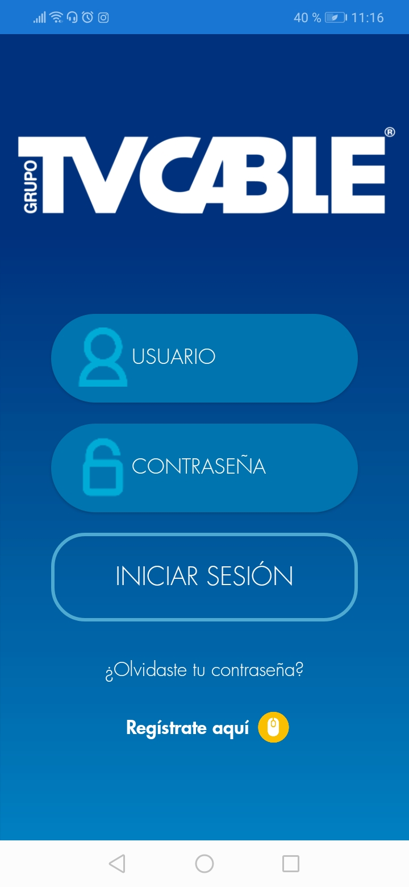
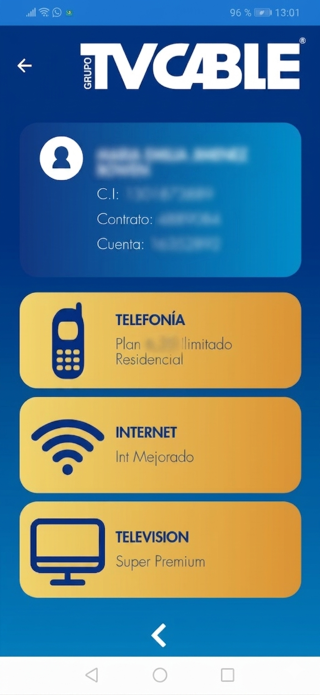

> **Grupo TVCable clients needed support around the clock — but the only option was calling. TTVCable Mobile Agencyl changed that: a branded app designed from scratch to put account management, payments, and promotions directly in the hands of every client, 24/7.**

### Project Overview

TVCable Mobile Agency was created as the official mobile application for Grupo TVCable — giving clients a direct, always-available channel to manage their account without needing to visit an office or call support. The app was designed entirely in-house, from brand identity to final screens, and launched on both Google Play and the App Store.

The name, the brand, and every screen in the app came out of this project.

---

### Role

UX/UI Designer · In-house · Xtrim / Grupo TVCable (2019)

---

### Brand & Design System

With no existing app or digital product identity to build on, everything was created from scratch.

- Brand name **TVCable Mobile Agency** created for the app
- Full color palette defined from zero
- Custom icon set, buttons, and UI components designed for mobile context
- Visual language built to feel modern and accessible for a broad client base — supporting the 24/7 self-service positioning of the product

---

### Screen Design

Every screen in the app was designed end to end.

**Login**

**Home**

**Client Account**

---

**Account Status**

---

**Payments**

**Promotions & Communications**

---

**Profile**

---

### Tools

- Adobe Illustrator — UI design, iconography, and brand assets
- Adobe Photoshop — image editing and visual composition

---

### Value Delivered

TVCable Agencia Móvil launched as Grupo TVCable's first mobile self-service channel — available 24 hours a day, 7 days a week, on both Android and iOS. The app gave clients direct access to payments, account status, promotions, and support without depending on physical offices or call centers. Every screen, every component, and the brand itself were created as part of this project.

## Download

- [Google Play →](https://play.google.com/store)
