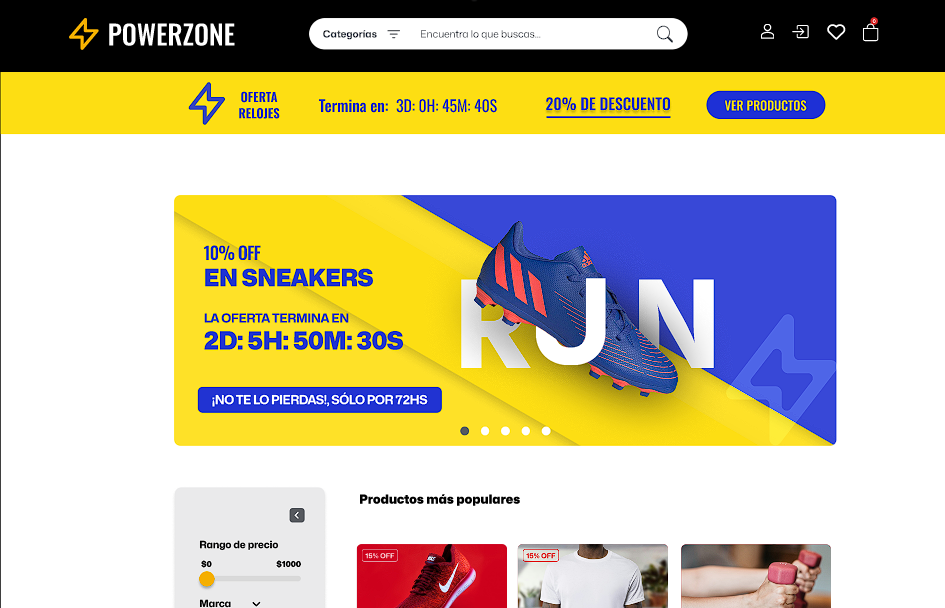

## Project Overview

As an extension of the PowerZone gym platform, the e-commerce component enables users to purchase workout products and digital training plans directly online.

## Main Features:

- Online purchase of workout gear and digital plans.
- Integration with the existing user experience and layout.
- Shopping flow with cart and product management.

## Architecture

- Integrated into the same frontend (React + Tailwind CSS).
- Backend shared with the main platform: Express.js and PostgreSQL.
- E-commerce endpoints for product handling and order processing.

## Repositories

Frontend Code:
Backend Code:
Design:

Figma prototypes for product listing, checkout flow, and responsive e-commerce layout.
