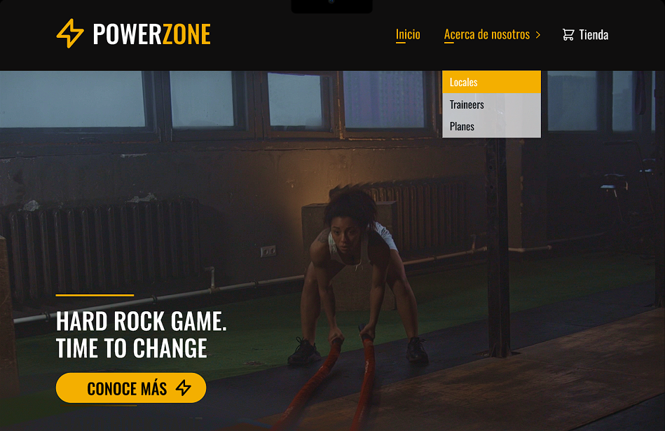

> **Why is finding a gym and subscribing still so complicated in Latin America? That question was the starting point for PowerZone — a fitness web platform designed for young users who want to explore locations, meet trainers, and choose their plan without friction. I led the full UX/UI and contributed to frontend development within a team of three.**

### Project Overview

PowerZone was born from a simple observation: in the Latin American fitness market, the digital experience of gyms tends to fall far behind the physical experience they offer. Subscribing to a plan, finding the nearest location, or getting to know the trainers should be intuitive — and it rarely is.

---

### Role

UX/UI Lead · Frontend Developer · Team of 5

---

### User Persona

Young adults between 18 and 30 — digitally native, active, and expecting a seamless experience when choosing a gym and a plan. No patience for confusing flows or cluttered interfaces.

---

### Discovery & Research

Competitive analysis of the fitness market across Latin America to identify navigation patterns, subscription models, and usability gaps — no direct user interviews, but a clear picture of where existing platforms were failing their users.

---

### Design Process

Proposed the full visual system independently, validated it with the team in a consensus session, and ran 2 to 3 iteration rounds in Figma — from low-fidelity wireframes to a high-fidelity interactive prototype.

---

### Usability Iteration

The Subscription Plans section wasn't communicating the options clearly. Redesigned it from scratch to reduce cognitive load and make plan comparison feel effortless — the single change with the most impact on the overall experience.

---

### Design to Development Handoff

Contributed to frontend implementation using React, JavaScript, and Tailwind CSS — ensuring design consistency between the Figma prototype and the live product.

---

### Core Experience

- Competitive research across the Latin American fitness market
- User persona definition focused on young, digitally native users
- Full visual system proposed and executed independently
- Subscription Plans section redesigned for clarity and ease of decision-making
- Responsive UI built in Figma — from wireframes to final prototype
- Frontend implementation with React, JavaScript, and Tailwind CSS

---

### Figma Prototype

**First Wireframe & Prototype**

The first iteration focused on mapping the core user flows before any visual decisions were made. This phase covered the foundational design system — typography, color palette, buttons, and icons — alongside the key screens: homepage, hero section, CTA, gym locations, trainer profiles, and subscription plan browsing. Together, these established the structure, visual language, and navigation logic that would guide every decision moving forward.

<iframe style="border: 1px solid rgba(0, 0, 0, 0.1);" width="800" height="450" src="https://embed.figma.com/design/pl1FmD9aQCRQmASY08gO8w/PowerZone?node-id=0-1&embed-host=share" allowfullscreen></iframe>

 

<iframe style="border: 1px solid rgba(0, 0, 0, 0.1);" width="800" height="450" src="https://embed.figma.com/proto/pl1FmD9aQCRQmASY08gO8w/PowerZone?node-id=2-40&p=f&scaling=scale-down&content-scaling=fixed&page-id=0%3A1&embed-host=share" allowfullscreen></iframe>

---

**Final Interactive Prototype**

After 2 to 3 iteration rounds — including a full redesign of the Subscription Plans section to reduce cognitive load — the design expanded to cover both desktop and mobile versions. Special attention was given to maintaining visual consistency and responsive behavior across breakpoints, ensuring the experience felt equally polished on every screen size. The final prototype reflects a complete, handoff-ready design system.

<iframe style="border: 1px solid rgba(0, 0, 0, 0.1);" width="800" height="450" src="https://embed.figma.com/design/u8mlRPtDkIS3321W3Ndei1/PowerZone---Gimnasios?node-id=4791-419&embed-host=share" allowfullscreen></iframe>

 

<iframe style="border: 1px solid rgba(0, 0, 0, 0.1);" width="800" height="450" src="https://embed.figma.com/proto/u8mlRPtDkIS3321W3Ndei1/PowerZone---Gimnasios?node-id=5030-2304&p=f&scaling=scale-down&content-scaling=fixed&page-id=4791%3A419&embed-host=share" allowfullscreen></iframe>

---

### Tech Stack

**Frontend**

- Design: Figma — wireframes, UI mockups, interactive prototype
- Framework: React + Node.js
- Styling: Tailwind CSS

**First Wireframe & Prototype**

The first iteration focused on mapping the core user flows before any visual decisions were made. This phase covered the foundational design system — typography, color palette, buttons, and icons — alongside the key screens: homepage, hero section, CTA, gym locations, trainer profiles, and subscription plan browsing. Together, these established the structure, visual language, and navigation logic that would guide every decision moving forward.

**Backend**

- Framework: Express.js
- Database: PostgreSQL
- Authentication: JWT (JSON Web Tokens)

[Backend Git Repository →](https://github.com/mpcevallos/Backend_gym)

---

### Value Delivered

A fully deployed frontend that solves the core fitness user journey: discover, compare, and subscribe. The visual system was designed from scratch, validated with the team, and refined based on real feedback — with people saying the platform made them actually want to sign up for a gym. The architecture is ready to scale toward active authentication and membership management once backend hosting is reinstated.

## Deployment

[Backend Git Repository →](https://paudevportfolio.netlify.app/)
