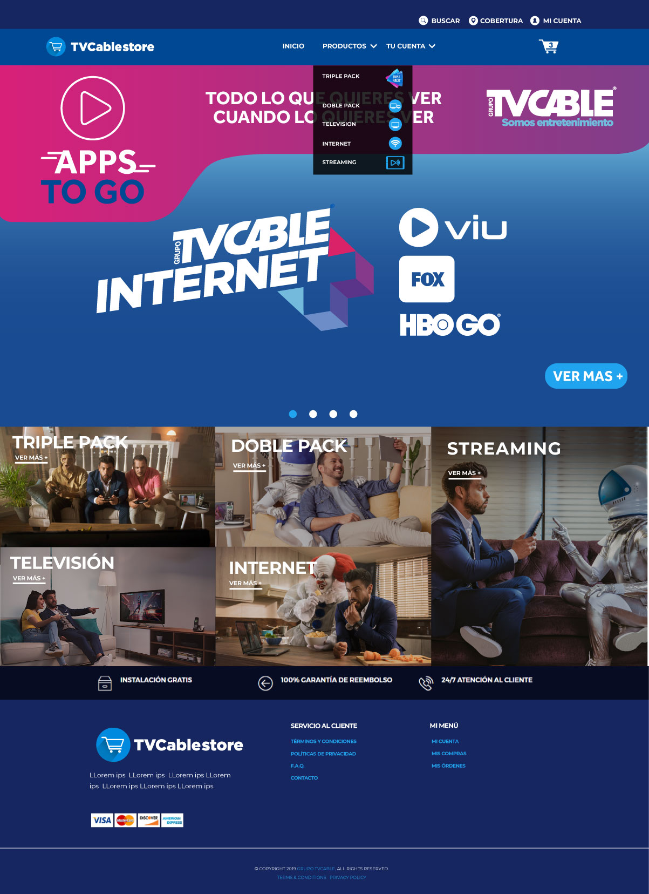

## Features

- Led the UX/UI design for a WordPress-based website, focusing on user-centered design principles and enhancing overall usability.

Collaborated with the development team to implement geolocation features, allowing users to access tailored content based on their location.

Created wireframes, prototypes, and final designs to ensure a seamless user experience across various devices.

Utilized Adobe Photoshop and other design tools to develop visually appealing and functional web layouts.

## Demo

[Sink.Cool](https://sink.cool/dashboard)

### Site-wide Analysis

  
<b>Link Management</b>

  

  
<b>Individual Link Analysis</b>

  

