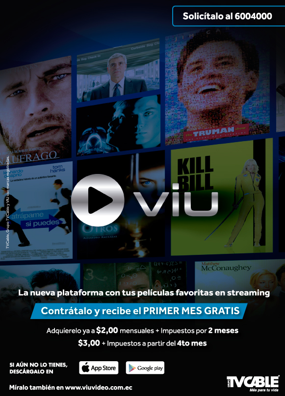

> **Hollywood blockbusters, accessible pricing, and a brand built from scratch — VIU was Grupo TVCable's answer to the streaming boom, designed to compete in a market dominated by Netflix and Prime with a product made specifically for their client base.**

### Project Overview

VIU was designed and branded from scratch for Grupo TVCable — a streaming app giving clients access to Hollywood blockbuster films across multiple categories including Drama, Action, and Children's content, at a low monthly cost. The app launched on Android, iOS, and web, with a complete brand identity system created as part of this project.

As a submenu of VIU, **VIU Sports** was also created — a dedicated landing page giving TVCable clients exclusive access to live football matches and other sports events through a username and password login.

---

### Role

UX/UI Designer · Brand Designer · In-house · Xtrim / Grupo TVCable (2019)

---

### Brand Identity

The VIU brand was created entirely from scratch — including multiple versions for different use cases across digital and physical contexts.

- Full brand identity designed for VIU
- Logo variations: full color, white, black, and gradient versions
- App icon designed for both iOS and Android platform guidelines
- Web background designed with adaptations for multiple mobile device screen sizes
- Promotional banner designed for web

---

### Web Banner

### Promotional Video

  <iframe
    src="https://www.youtube.com/embed/Z02SU0soXds"
    style="position: absolute; top: 0; left: 0; width: 100%; height: 100%; border: none;"
    allowfullscreen
    loading="lazy"
  ></iframe>

---

### VIU Sports

VIU Sports was created as a submenu of the VIU platform — a dedicated landing page giving TVCable clients exclusive access to live football matches and other sports events. Access was gated behind a username and password, keeping the experience exclusive to active subscribers.

**Launch Event — Ecuador vs Bolivia**

The platform's first major event was the Ecuador vs Bolivia friendly match on September 10 — promoted across TVCable's digital channels and available for purchase directly from the remote control on channels 750 HD and 250 SD, or online through VIU Sports.

- The event generated $10K in revenue — validating the business model and the platform's conversion potential from day one

**VIU Sports Web**

 

**VIU Sports Mobile Web**

---

### Design Process

The VIU brand and interface went through multiple iteration rounds in collaboration with the IT department — refining the visual identity, screen layouts, and platform adaptations based on feedback from both the development team and internal stakeholders.

---

### Tools

- Adobe Illustrator — brand identity, logo, iconography, and UI assets
- Adobe Photoshop — image editing, promotional materials, and visual composition

---

### Availability

VIU and VIU Sports were published and made available to Grupo TVCable clients across Android, iOS, and web platforms.

---

### Value Delivered

A complete streaming brand and product — from logo to app icon to landing page — built for one of Ecuador's largest telecommunications companies. VIU gave Grupo TVCable a competitive streaming offering tailored to their client base, while VIU Sports demonstrated immediate commercial impact with $10K in revenue generated from its first live sports event.
